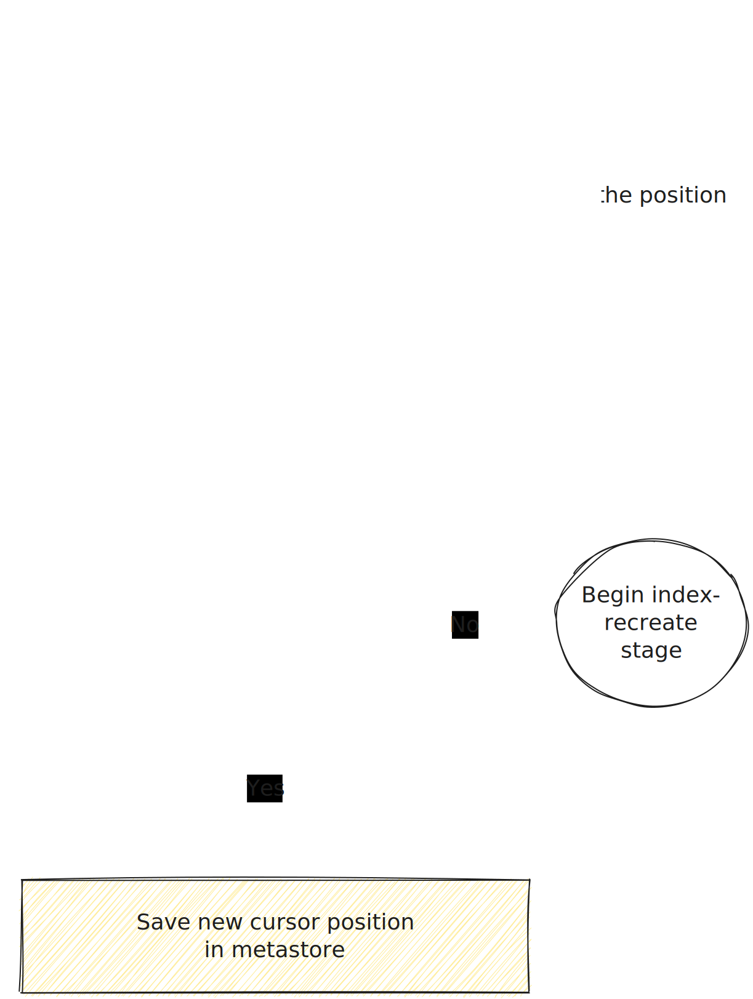

# Indexing and recovery

This doc covers the process of how lnx recovers from a crash where some documents stored in the block store
might not have been indexed yet.

This process can be fairly non-obvious (hence the doc) because the block store and indexer are completely isolated
from one another, so we need some way of working out what point we got to in indexing vs what we have on the store.

### Useful Terms

- `storage shard` The storage actor which feeds data into the indexer.
- `checkpoint` The position in the store shard that the indexer has processed up to.
- `indexing actor` The actor that is actually processing and pushing the documents into tantivy.

### Overview

Internally the block store and the indexing system are isolated and aren't strict aware of each other, but they
do need some way of determining the point in which they got to when loading from a crash, etc...

So how do we solve this issue? The answer is quite simple, because the number of storage shards is
fixed (being the number of cores available.) and the number of indexing actor allowed to run at one time is also fixed
where `num_storage_shards <= num_indexing_actors`, we can say that a given storage shard can only be used to write 
data for a particular indexing actor.

#### Why is this significant?

If we know the storage shard can only hold data which has yet to be indexed for a single indexer, our metadata service
has only got to keep a single cursor for the whole file, since only one indexer can advance this cursor.
Recovery is then as simple as reading the position we last got to when committing.

